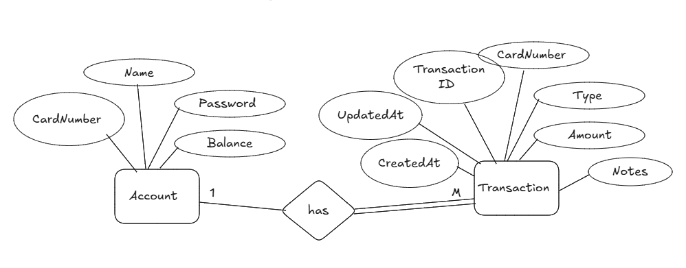
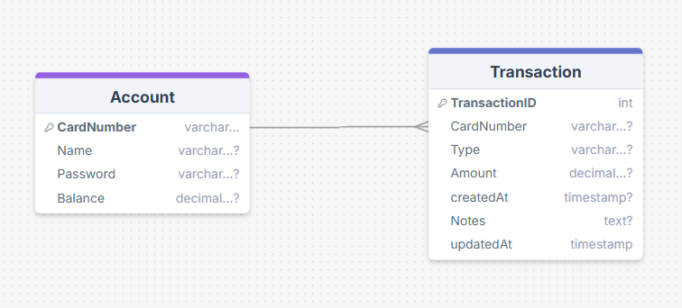

# 🏦 Bank Service – Microservice for Payments & Transactions

The **Bank Service** handles  payment processing, account balance updates, and transaction logging .

---

## ✨ Features

- Create and manage bank accounts
- Deposit and withdraw funds
- Record all transactions with type and timestamps
- Debit/Credit integration for order and rollback (Saga support)
- RESTful APIs with pagination and validation
- RabbitMQ-based event handling
- Global exception management

---

## 🧠 Entity Relationship Diagram (ERD)

---

## 🗄️ Database Schema

---

## 🌐 API Endpoints

| Method | Endpoint                                       | Description              |
|--------|------------------------------------------------|--------------------------|
| POST   | `/api/v1/accounts`                             | Create account           |
| GET    | `/api/v1/accounts`                                | Get paginated accounts   |
| GET    | `/api/v1/accounts/{cardNumber}`                   | Get single account       |
| PUT    | `/api/v1/accounts/{cardNumber}`                   | Update account           |
| DELETE | `/api/v1/accounts/{cardNumber}`                   | Delete account           |
| POST   | `/api/v1/accounts/{cardNumber}/deposit?amount=X`  | Deposit funds            |
| POST   | `/api/v1/accounts/{cardNumber}/withdraw?amount=X` | Withdraw funds           |
| GET    | `/api/v1/accounts/{cardNumber}/transactions`      | Paginated transactions   |

---

## 🛠️ Technologies Used

- Java 
- Spring Boot 
- Spring Data JPA + Hibernate
- PostgreSQL (or H2 for testing)
- MapStruct
- RabbitMQ
- Docker 
- Maven

---
